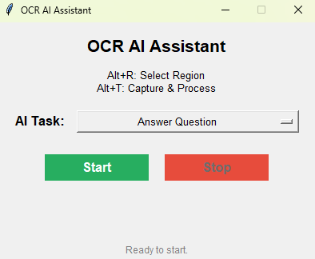
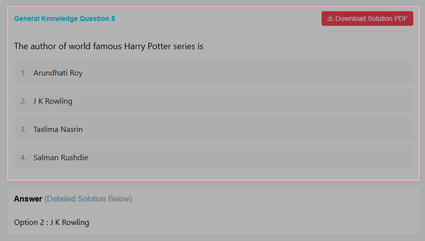
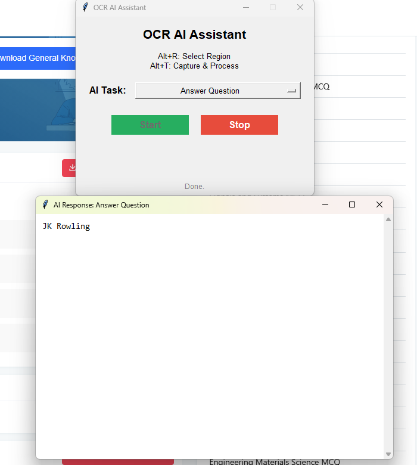

# OCR AI Assistant

**OCR AI Assistant** is a lightweight Windows desktop tool that uses OCR and a locally hosted language model to extract screen text and provide intelligent, instant answers. Fully offline, privacy-respecting, and fast.

### Main Interface



## Features

- Select any region of the screen using a global shortcut (Alt + R)
- Extract text using Tesseract OCR
- Send the text to a local AI model (Ollama) with a single hotkey (Alt + T)
- View immediate, concise responses in a native GUI
- No internet connection required after setup

## Example Use Cases

- Understand or summarize content from videos, games, or presentations
- Translate technical documentation and error messages instantly
- Simplify on-screen instructions or dense paragraphs
- Enable accessibility support for visually impaired users

---

## Installation

### 1. Install Python (3.8+)

Download Python from [python.org](https://www.python.org/).  
During installation, make sure to check "Add Python to PATH".

### 2. Install Tesseract OCR

Download the Windows build from the [UB Mannheim repository](https://github.com/UB-Mannheim/tesseract/wiki).  
The application assumes this default path:

C:\Program Files\Tesseract-OCR\tesseract.exe

### 3. Install Required Python Packages

Open Command Prompt and run:

```pip install -r requirements.txt```


Alt + R: Select a region of the screen

Alt + T: Capture, extract, and send text to the local AI model

The AI's answer will appear in a new window

The status bar indicates system readiness and running services.

Screenshots

### Screen Capture Selection


### OCR Output & Answer


## Project Goals

Seamless integration of OCR with Python desktop automation

Simple communication with a local LLM using HTTP APIs

Fast, reliable native GUI for real-time productivity

Fully offline functionality with privacy-first design

# Troubleshooting

If tesseract.exe is not found, check or update the TESSERACT_PATH variable in the script

Ensure ollama serve is running in the background

If hotkeys or GUI features are unresponsive, try running the script as administrator

Adjust Windows screen scaling settings for better OCR results 

# License

This project is licensed under the MIT License.

# Author

Saurabh850
Focused on building offline-first, automation-enhanced AI tools for personal computing.